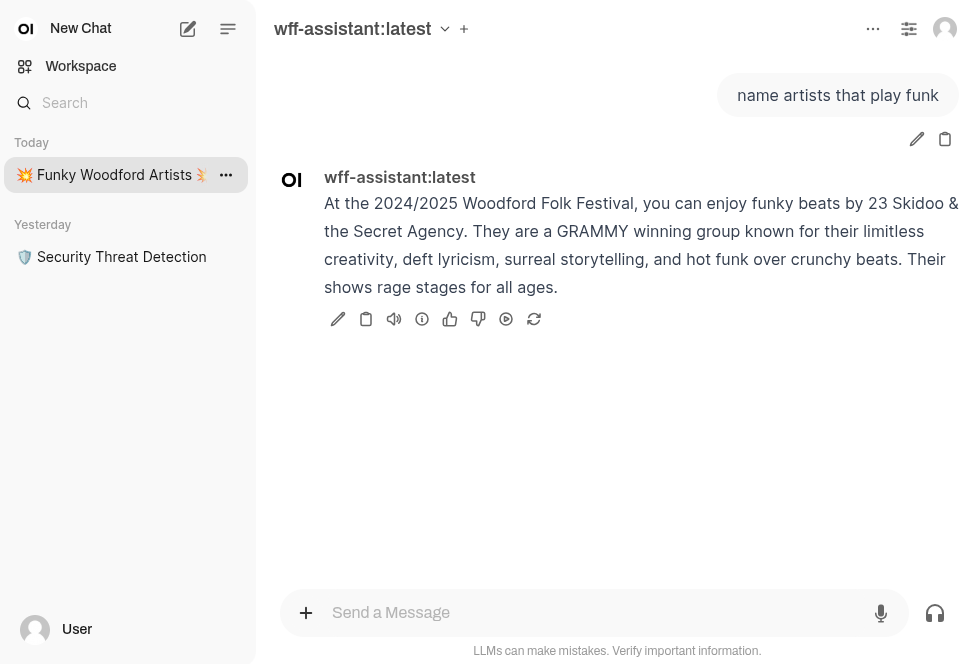

# Festival Chat Assistant


## Setting up a basic ollama model (with docker)

Make a container that runs ollama

```
docker run -d -v ollama:/root/.ollama -p 11439:11434 --name wffexper ollama/ollama:latest
```

Now bring the model into the container and run it (different models [here](https://ollama.com/search))

```
docker exec -it wffexper ollama pull mistral:7b 
docker exec -it wffexper ollama run mistral:7b
```

You can test it : `docker exec -it wffexper ollama run mistral:7b`


## Using a `Modelfile` system prompt

See [WFF-Modelfile-manual](WFF-Modelfile-manual)

This is just a sample - the idea with this approach would be to load ALL the relevant data in - however, as we found, this would result in a UX where the model is far too slow to respond.

Then create the `WFF-Modelfile` file, we have a template,
copy that and use scripts to fill in all artists, and other info you 
want baked into the model. (NB: first line is the model name)   
**This file would be the per-festival configuration for the Moment Festival Chat Assistant**    
and bring it into the container

```
docker cp WFF-Modelfile-manual wffexper:/tmp/WFF-Modelfile
docker exec -it wffexper ollama create wff-assistant -f /tmp/WFF-Modelfile
```

You can test it : `docker exec -it wffexper ollama run wff-assistant`


**I noticed this is MUCH slower - and then found out that the Modelfile is sent on each request to the model, its a system prompt - so now we look for a new approach**    
***(see "Finetuning" below)***


---
---
---


## GUI - Web Chat Interface

We want a nice Chat UI interface


### Custom chat interface

See [index.html](index.html) 

To run it locally

```
serve
```

http://localhost:8080/

</img>


WIP -- this is where I'm up to -- we have tried a few things -- our own version (index.html) looks good, but it doesn't remember context - so i'm going back to trying Web UI, and seeing if we can style it how we want - hide the side menu and such ... this will be a task for tomorrow - if it does look good - and if it is smart and quick, then the next job will be ...
oh - to load in all of last years data,
and then also to host it somewhere --- and that is it for a working PoC !!


### WebUI chat interface

This is rich, and looks great.

I assumed it would remember chat context too - for a much better user experience - but based on my experiments it wouldn't.

I wasn't able to customise the UI (remove the side bar, adjust the default prommpt suggestions, preselecting the model) in my initial attempts - but I think that should be do-able with more effort.

To run this:

```
# Stop current container
docker stop open-webui && docker rm open-webui


# Try with environment variables for sidebar
docker run -d --name open-webui -p 3000:8080 \
 --add-host=host.docker.internal:host-gateway \
 -v open-webui:/app/backend/data \
 -e WEBUI_AUTH=False \
 -e ENABLE_COMMUNITY_SHARING=false \
 -e OLLAMA_BASE_URL=http://host.docker.internal:11439 \
 -e WEBUI_SIDEBAR=false \
 --restart always \
 ghcr.io/open-webui/open-webui:main
```

http://localhost:3000/

</img>

---
---
---


## Fine tuning

To bake what is in the Modelfile into the model itself - to massivly increase the response time (because it isn't loading that in every time) - we would need to fine-tune the model itself.

Here is Claude's assessment of doing that on my laptop:

Based on your system specs, here's my precise assessment:
Your System:

GPU: Intel integrated graphics only (no dedicated GPU)
RAM: 38GB (excellent!)
Storage: 285GB free (plenty)

Fine-tuning Assessment:
❌ GPU Fine-tuning: Not possible

You have no NVIDIA GPU, so no CUDA acceleration
Intel integrated graphics can't handle ML training

⚠️ CPU Fine-tuning: Technically possible but impractical

Time estimate: 3-7 days for your 2000-artist dataset
Would consume significant system resources
Your laptop would be unusable during training

✅ Google Colab: Your best option

Free T4 GPU: 6-12 hours training time
Colab Pro ($12/month): Faster GPUs, shorter time
Upload your data, run training scripts, download result

My Recommendation:
For fine-tuning: Use Google Colab free tier

Convert your 2000 artists to training format locally
Upload to Colab and run QLoRA fine-tuning
Download the finished model back to your laptop
Total cost: Free (or $12 for faster)

Alternative: Since you have excellent RAM (38GB), you could run much larger base models locally with your current setup. A 13B or even 70B model with good prompting might give you results similar to fine-tuning a 7B model.
Want me to help you set up the Colab fine-tuning approach, or try a larger base model first?


---
---
---

Other notes in this Google Doc : https://docs.google.com/document/d/1HAtqUd1559oMHsY_iKoPr3-9u9GdqwwMpDP4HqpVf7U/edit


